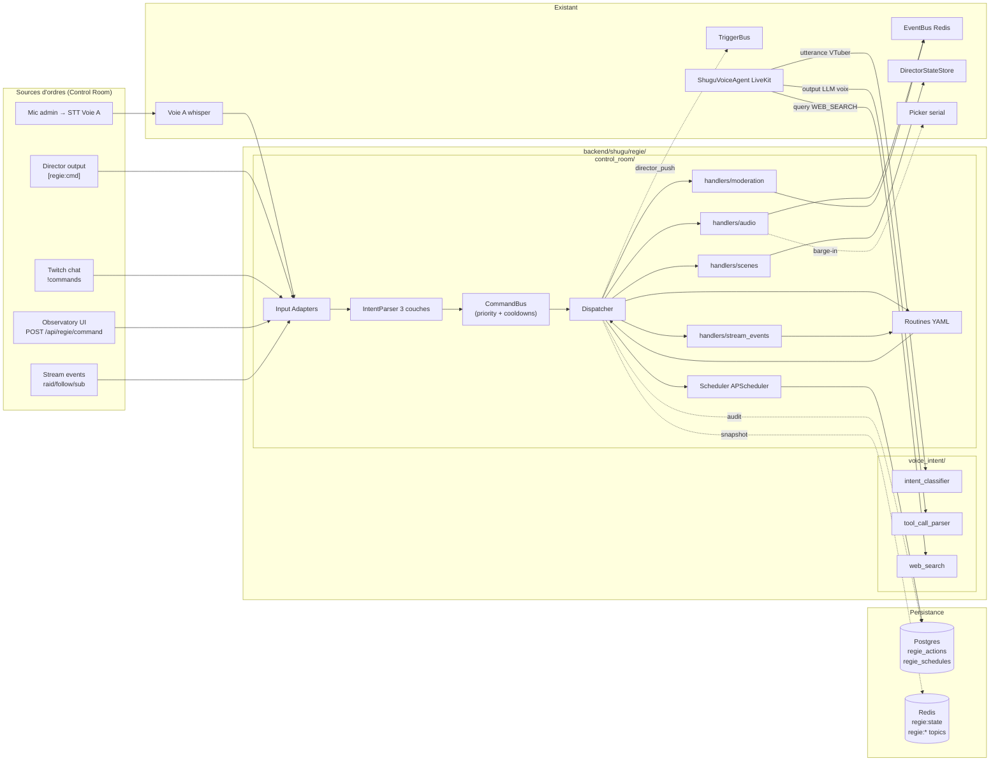

# Régie — Architecture (`backend/shugu/regie/`)

> **Branche initiale** : `claude/competent-spence-0c765e` (worktree)
> **Plan source** : `C:\Users\rafai\.claude\plans\il-faudrais-travailler-sur-tranquil-harp.md`
> **Sprint R.0** — Document fondateur (ADR + spec). Aucun code livré ici.
> **Date** : 2026-05-09

---

## Vision

Le package `backend/shugu/regie/` regroupe **toutes les capacités de régie** du stream sous un namespace unique. Il fusionne deux sous-modules complémentaires :

| Sous-module | Rôle | Déjà existant ? |
|---|---|---|
| `regie.voice_intent` | Classifie les utterances **du VTuber** (CHAT / WEB_SEARCH / EMOTION / EMOTE) pour le pipeline LiveKit voix. Fournit aussi `tool_call_parser` (parse tags Gemma dans output LLM voix) et `web_search` (Tavily + Brave providers). | Oui — relocalisé depuis `backend/shugu/voice/regie/` (Sprint R.0.5) |
| `regie.control_room` | Plateau technique : pilote scènes / timers / sons / events stream / modération sur ordre admin (voix mic, slash chat, tags Director, UI Observatory). 95 % règles déterministes, 5 % LLM local CPU. | Non — livré dans cette spec (Sprint R.1 → R.12) |

Les deux sous-modules sont distincts (rôles, sources, latence cible) mais partagent un même namespace pour éviter le déversement de "régie-like code" partout dans `voice/`. Conforme à la règle cardinale `docs/PHASE1-FOUNDATION.md` :

> Les *senses*, *régie*, *memory* sont des **services** Python (pas des agents LLM).

### Distinction Director / Régie

| Module | Rôle | LLM | Latence cible |
|---|---|---|---|
| `director/` (existant) | Âme conversationnelle. 1 LLM persona produit des tags inline `[outfit:X] [vfx:Y] [say_emotion:Z]`. | Oui (5–8 k appels/jour visés) | 1–3 s par tick |
| `regie.voice_intent` (existant) | Classification d'intent voix VTuber pour brancher le pipeline LiveKit. | Non (regex) + appel LLM voix séparé | <5 ms |
| `regie.control_room` (cette spec) | Plateau technique. 95 % règles déterministes + 5 % LLM local CPU pour intent NL admin. | Optionnel (Gemma 4 E4B local CPU) | <100 ms (95 %), 1–2 s (5 %) |

Objectif : **soulager le LLM persona** en déléguant l'orchestration technique au plateau, qui décide par règles, sans surcoût.

---

## Périmètre

### Dans le scope MVP (R.0 → R.9)

- Migration du sous-module voice intent sous le namespace `regie/` (sprint R.0.5)
- Scheduler / timers persistés (APScheduler + Postgres)
- Switch de scènes automatique (réutilise `director.scene_state`)
- Soundboard (SFX on-trigger ou on-command) + ducking musique
- Réactions à stream events (raid / follow / sub / donation) via routines YAML
- 4 canaux d'entrée : voix admin (mic local STT), tags Director `[regie:*]`, slash chat Twitch, UI Observatory
- IntentParser à 3 couches (regex → keywords → llama.cpp local CPU)
- Audit log Postgres de toutes les actions
- UI Observatory dédiée (page Régie avec SSE live)

### Hors scope MVP (V2, R.10 → R.12)

- Modération avancée (bayésien, captcha, raid mode auto)
- Couche 3 LLM (Gemma 4 E4B GGUF) — livrée R.11 mais non bloquante MVP
- Macros graphiques (drag & drop builder UI)

### Hors scope définitif

- Dépendance à un framework agentique (LangGraph, CrewAI, OpenCode)
- Tool-use LLM côté persona pour orchestrer scènes / sons / overlays
- Wake-word always-on côté micro admin — push-to-talk uniquement (privacy + faux positifs)

---

## Position dans l'architecture globale



---

## Concepts clés (Control Room)

### `Command` (modèle Pydantic)

Point d'entrée unifié, quelle que soit la source. Discriminated union par `kind`.

```python
class CommandKind(str, Enum):
    SCENE_SWITCH        = "scene_switch"
    SCHEDULE            = "schedule"
    PLAY_SFX            = "play_sfx"
    RUN_ROUTINE         = "run_routine"
    DUCK_MUSIC          = "duck_music"
    MOD_ACTION          = "mod_action"
    DIRECTOR_PUSH       = "director_push"
    CANCEL_SCHEDULED    = "cancel_scheduled"

class CommandSource(str, Enum):
    VOICE_ADMIN         = "voice_admin"
    DIRECTOR_TAG        = "director_tag"
    CHAT_SLASH          = "chat_slash"
    UI_OBSERVATORY      = "ui_observatory"
    STREAM_EVENT        = "stream_event"

class Command(BaseModel):
    id: str                          # ULID
    source: CommandSource
    kind: CommandKind
    payload: dict[str, Any]          # validé par kind via discriminated union
    issued_by: str                   # admin user_id, "director", "system"
    issued_at: datetime
    priority: int = 5                # 0=critical (raid), 5=normal, 9=low
    correlation_id: str | None = None
```

### `Routine` (YAML déclaratif)

Enchaînement d'étapes lisibles, validé par schéma Pydantic strict au chargement. Pas de code Python par routine, pas d'évaluation arbitraire.

```yaml
# regie/control_room/routines_lib/raid_thanks.yaml
id: raid_thanks
description: "Remerciement automatique sur raid Twitch"
params:
  raider:        { type: string, required: true }
  viewer_count:  { type: int, required: true }
trigger:
  on: stream_event
  match: { kind: raid }
steps:
  - kind: play_sfx
    sfx_id: applause_short
    duck: 0.4
  - kind: scene_switch
    scene_id: thanks_overlay
    transition: fade_500ms
  - kind: director_push
    trigger_kind: raid_arrival
    context:
      raider: "{{ params.raider }}"
      viewers: "{{ params.viewer_count }}"
  - kind: wait
    duration_ms: 8000
  - kind: scene_switch
    scene_id: "{{ state.previous_scene }}"
    transition: fade_500ms
on_error:
  policy: continue   # | abort | retry_3x
audit: true
```

**Templating** : substitution `{{ params.X }}` et `{{ state.Y }}` uniquement, regex strict ~30 lignes maison. **Pas de Jinja2** (overkill + risque injection).

**Hot reload** : `watchdog` sur `routines_lib/` → snapshot pris au démarrage de chaque routine, pas d'impact sur exécutions en cours.

### `Schedule` (timer persisté)

```python
class Schedule(BaseModel):
    id: str                          # ULID
    when: datetime | timedelta | str  # timestamp | délai | crontab
    command: Command
    repeat: bool = False
    created_at: datetime
    cancelled_at: datetime | None = None
```

Persisté dans `regie_schedules` (Postgres). APScheduler `AsyncIOScheduler` avec custom JobStore basé sur cette table, **pas de pickle** (deserialization-safe). Au boot, jobs futurs réhydratés ; jobs passés (drift > 5 min) skippés et loggués.

### `IntentParser` (3 couches en cascade)

Pour la voix admin uniquement — chat slash et tags director sont déjà structurés.

| Couche | Méthode | Latence | Couverture cible |
|---|---|---|---|
| 1 | regex compilées (timeout intégré, patterns pré-compilés au boot) | <1 ms | ~80 % |
| 2 | keywords + slot fillers (extraction params temporels/cibles) | <5 ms | ~15 % |
| 3 | llama.cpp HTTP (Gemma 4 E4B Q4_K_M, JSON schema strict, timeout 3 s) | 1–2 s CPU | ~5 % |

**Modèle couche 3** : `google/gemma-4-E4B` GGUF Q4_K_M (~4,5 GB), placé dans `E:\ai\models\gemma-4-e4b\`. Servi par `llama.cpp` HTTP server local (déjà installé `E:\ai\tools\llama.cpp\`), CPU only, port 8080. Démarrage géré par `scripts/start_llamacpp.ps1` hors process FastAPI.

---

## Modules — Arborescence cible (post R.0.5 + R.9)

```
backend/shugu/regie/
├── __init__.py                          # Exports : VoiceIntent, ControlRoom
│
├── voice_intent/                        # Sous-module ex-voice/regie/ (R.0.5)
│   ├── __init__.py
│   ├── intent_classifier.py
│   ├── tool_call_parser.py
│   └── web_search.py
│
└── control_room/                        # Sous-module nouveau (R.1 → R.12)
    ├── __init__.py                      # API publique + factory get_control_room()
    ├── core.py                          # ControlRoom main loop, lifecycle
    ├── command_bus.py                   # asyncio.PriorityQueue + cooldowns + audit
    ├── models.py                        # Pydantic: Command, Routine, Schedule
    ├── state.py                         # Snapshot Redis-backed, TTL 24 h
    ├── scheduler.py                     # APScheduler + custom JobStore JSONB
    ├── intent_parser.py                 # 3 couches regex → keywords → llama.cpp
    ├── routines.py                      # Macros YAML, runner séquentiel/parallèle
    ├── handlers/
    │   ├── __init__.py
    │   ├── stream_events.py             # raid/follow/sub/donation → routine
    │   ├── scenes.py                    # switch scènes (réutilise director.scene_state)
    │   ├── audio.py                     # soundboard + ducking via WS audio:*
    │   └── moderation.py                # banwords + slowmode_toggle (R.10)
    ├── inputs/
    │   ├── __init__.py
    │   ├── voice_admin.py               # STT mic admin → Command
    │   ├── chat_slash.py                # !commands Twitch IRC → Command
    │   ├── director_tags.py             # tag [regie:*] dans output Director → Command
    │   └── ui_observatory.py            # POST /api/regie/command + SSE
    └── routines_lib/
        ├── raid_thanks.yaml
        ├── follow_lite.yaml
        ├── sub_thanks.yaml
        ├── donation_thanks.yaml
        ├── outro.yaml
        └── brb.yaml
```

**Contraintes modulaires** (`feedback_modular_architecture`) : ≤ 400 lignes par fichier, 1 responsabilité, docstrings FR.

---

## Pipeline Control Room

```
[Source] → InputAdapter → IntentParser → Command → CommandBus
                                                      │
                                          [validation Pydantic]
                                          [cooldown check]
                                          [priority heap: raid=0 > admin=5 > UI=7]
                                                      │
                                                  Dispatcher
                                                      │
                          ┌──────────┬─────────┬─────┴──────┬──────────┐
                          ↓          ↓         ↓            ↓          ↓
                       scenes/   audio/  stream_events/  moderation/  scheduler/
                          │          │         │            │          │
                          └─── EventBus.publish("regie:action_done") ───┐
                                                                         ↓
                                                       audit log Postgres + SSE Observatory UI
```

---

## Persistance

### Migration Alembic 0011

```sql
CREATE TABLE regie_actions (
    id              VARCHAR(26) PRIMARY KEY,    -- ULID
    command_kind    VARCHAR(40) NOT NULL,
    source          VARCHAR(20) NOT NULL,
    issued_by       VARCHAR(80) NOT NULL,
    payload         JSONB NOT NULL,
    status          VARCHAR(20) NOT NULL,       -- queued|running|success|failed|cancelled
    error           TEXT,
    correlation_id  VARCHAR(26),
    created_at      TIMESTAMPTZ NOT NULL DEFAULT NOW(),
    completed_at    TIMESTAMPTZ
);
CREATE INDEX idx_regie_actions_created_at ON regie_actions (created_at DESC);
CREATE INDEX idx_regie_actions_correlation ON regie_actions (correlation_id);

CREATE TABLE regie_schedules (
    id              VARCHAR(26) PRIMARY KEY,    -- ULID
    when_utc        TIMESTAMPTZ,                -- one-shot ; NULL si cron
    cron_expr       VARCHAR(80),                -- crontab ; NULL si one-shot
    command_json    JSONB NOT NULL,             -- Command Pydantic re-validé au load
    repeat          BOOLEAN NOT NULL DEFAULT FALSE,
    cancelled_at    TIMESTAMPTZ,
    created_at      TIMESTAMPTZ NOT NULL DEFAULT NOW(),
    last_fire_at    TIMESTAMPTZ,
    next_fire_at    TIMESTAMPTZ
);
CREATE INDEX idx_regie_schedules_next_fire ON regie_schedules (next_fire_at)
    WHERE cancelled_at IS NULL;
```

**Pas de pickle**. Le custom JobStore d'APScheduler lit/écrit en JSONB et re-valide chaque `Command` à la rehydratation.

### Snapshot Redis

Clé `regie:state` (JSON, TTL 24 h, refreshed à chaque mutation) — contient :
- `current_scene`, `previous_scene`
- `active_schedules_count`
- `last_routine_executed`
- `cooldowns: dict[str, expiry_ts]`

Topics EventBus `regie:*` (à valider non-collision en R.1) :
- `regie:command_received`, `regie:action_done`
- `regie:routine_started`, `regie:routine_completed`
- `regie:scheduled_added`, `regie:scheduled_cancelled`

---

## Sécurité

### Whitelist tags `[regie:*]` du Director

Le Director peut émettre des tags `[regie:cmd]` dans sa sortie LLM. Garde-fou critique : **un drift de persona ne doit jamais déclencher une action de modération ou un schedule arbitraire**.

| Kind autorisé depuis `[regie:*]` | Kind interdit depuis `[regie:*]` |
|---|---|
| `scene_switch` (sur scènes whitelistées) | `mod_action` |
| `play_sfx` (sur SFX whitelistés) | `schedule` |
| `duck_music` (level ≤ 0,6, duration ≤ 10 s) | `cancel_scheduled` |
| | `run_routine` (sauf routines whitelistées) |
| | `director_push` (anti-récursion) |

Tests obligatoires R.1 + R.8 : assert qu'une sortie Director simulée `[regie:mod_action:ban:user]` est rejetée et loggée.

### Auth par canal

| Canal | Auth | Note |
|---|---|---|
| Voice admin | Push-to-talk + device fingerprint + session admin | Pas de wake-word always-on. Mic permission expirable. |
| UI Observatory | Session cookie admin existante + role check | Réutilise auth existante. |
| Chat slash | Whitelist Twitch username + tag IRC `mod=1` ou `broadcaster=1` | Vérif côté parser PRIVMSG. |
| Director tags | Whitelist `kind` interne + double-validation Pydantic | Le LLM ne peut pas s'auto-élever. |

### Validation entrées

- **Routines YAML** : schéma Pydantic strict, refus + log si validation échoue. Templating regex strict, whitelist sources `params.*`, `state.scene`, `state.previous_scene`.
- **Regex utilisateur** : exclusivement patterns pré-compilés au boot (timeout intégré). Aucune regex saisie à chaud.
- **Persistence schedules** : `command_json: jsonb` re-validé Pydantic au load. Pas de pickle.
- **Cap horaire** : max 200 commandes/heure global, hard-cutoff avec alert SSE.

---

## Modèle de coût et ressources

| Composant | RAM | CPU idle | Latence | Coût LLM |
|---|---|---|---|---|
| `regie.voice_intent` (existant, déplacé) | inchangé | inchangé | inchangé | inchangé |
| `regie.control_room` core (asyncio) | +50 MB | <1 % | n/a | 0 € |
| Scheduler APScheduler | +20 MB | <1 % | <10 ms | 0 € |
| Couche 1 regex | +5 MB | 0 % | <1 ms | 0 € |
| Couche 2 keywords | +5 MB | 0 % | <5 ms | 0 € |
| Couche 3 llama.cpp Gemma 4 E4B (résident) | +5 GB | 0 % (idle) | 1–2 s (hot) | 0 € |
| Audit log + state | +20 MB | <1 % | n/a | 0 € |
| **Total ajouté par Control Room** | **~5,1 GB** | **~3 %** | **<100 ms (95 % cas)** | **0 €** |

`llama.cpp` tourne **hors process FastAPI** (subprocess séparé). Une OOM côté LLM ne tue pas le stream.

---

## Découpe en sprints

| # | Sprint | Description | Modèle | Effort | Dépend |
|---|---|---|---|---|---|
| R.0 | **CE DOC** + ADR scope/non-scope | — | 1 h | — |
| **R.0.5** | **Refactor `voice/regie/` → `regie/voice_intent/`** | 6 fichiers déplacés, 11 imports MAJ, CI vert obligatoire. Aucun changement comportement. | Haiku 4.5 | 1 h | R.0 |
| R.1 | Squelette `regie/control_room/` + models + state Redis + Alembic 0011 | Sonnet 4.6 | 2 h | R.0.5 |
| R.2 | CommandBus + cooldowns + audit log + tests | Sonnet 4.6 | 2 h | R.1 |
| R.3 | Scheduler APScheduler + persistance JSONB + tests | Sonnet 4.6 | 2 h | R.1 (∥ R.2) |
| R.4 | IntentParser couches 1+2 (regex + keywords) + tests | Sonnet 4.6 | 1,5 h | R.2 |
| R.5 | Routines YAML + runner + 3 routines + tests | Sonnet 4.6 | 2,5 h | R.2, R.3 |
| R.6 | Handlers : scenes + audio (soundboard + ducking) | Sonnet 4.6 | 3 h | R.5 |
| R.7 | Stream events handler + mapping config + tests | Sonnet 4.6 | 2 h | R.5 (∥ R.6) |
| R.8 | Inputs : voice_admin + chat_slash + director_tags | Sonnet 4.6 | 3 h | R.4, R.5 |
| R.9 | UI Observatory : page Régie + SSE + endpoints | Sonnet 4.6 | 3 h | R.5, R.7 |
| R.10 | Modération MVP (banwords + slowmode) + tests | Sonnet 4.6 | 1,5 h | R.7 |
| R.11 | IntentParser couche 3 : pull `gemma-4-E4B` GGUF + script + bench | Sonnet 4.6 | 2 h | R.4 |
| R.12 | Cleanup + docs FR finalisation + verify CI vert | Haiku 4.5 | 1 h | tous |

**Effort total** : ~26,5 h Sonnet + 2 h Haiku (R.0.5 + R.12) ≈ 28,5 h. **MVP livrable** : R.0 → R.9 (~22 h).

**Ordre conseillé** : `R.0 → R.0.5 → R.1 → (R.2 ∥ R.3) → R.4 → R.5 → (R.6 ∥ R.7) → R.8 → R.9 → R.10 → R.11 → R.12`.

À la fin de R.9, la régie sait : programmer un timer, switcher des scènes, jouer des SFX, ducker la musique, réagir à un raid via YAML, accepter des ordres voix admin / tag director / slash chat / UI, et auditer toutes les actions.

---

## Vérification end-to-end

À la fin de R.9, ces 5 scénarios doivent passer en intégration (Postgres + Redis + worker FastAPI réels, **pas** de mocks DB) :

1. **Timer** :
   `POST /api/regie/command` body `{kind: SCHEDULE, payload: {in: {seconds: 10}, action: {kind: SCENE_SWITCH, payload: {scene_id: cosy}}}}`
   → 10 s plus tard, `DirectorStateStore.scene == "cosy"` et entrée `regie_actions(kind=SCENE_SWITCH, status=success)` en DB.

2. **Raid** :
   `EventBus.publish("twitch:raid", {raider: "abc", viewer_count: 42})`
   → routine `raid_thanks.yaml` joue : event `audio:sfx{applause_short}` + `SCENE_SWITCH(thanks_overlay)` + `TriggerBus.publish(raid_arrival)` + retour scène précédente après 8 s.

3. **Voix admin** :
   Audio simulé `"lance la scène intro"` → IntentParser couche 1 matche → `Command(kind=SCENE_SWITCH, payload={scene_id: intro})` → audit log `source=voice_admin`.

4. **Tag Director** :
   Director émet `output_text="ok je vais ralentir [regie:duck_music:0.3:5000]"` → `inputs/director_tags.py` parse → event `audio:duck{level: 0.3, duration_ms: 5000}` publié.

5. **Slash chat** :
   Message Twitch IRC `!break 5min` du mod whitelist → `Command(kind=SCHEDULE, payload={in: {minutes: 5}, action: SCENE_SWITCH(brb)})` → confirmation chat publiée.

### Commandes de vérification

```powershell
# Tests unit + integration ControlRoom (post-R.9)
cd backend; uv run pytest tests/unit/regie/control_room tests/integration/regie/control_room -v --no-cov

# Tests voice_intent (post-R.0.5, doit rester 100 % vert)
cd backend; uv run pytest tests/unit/regie/voice_intent -v --no-cov

# Bench couche 3 (après R.11 + Gemma 4 E4B téléchargé)
cd backend; uv run python -m shugu.regie.control_room.bench_intent_parser

# Lint scope projet (préserver baseline 0 erreur)
ruff check backend/shugu/regie backend/tests/unit/regie backend/tests/integration/regie

# Coverage cible >85 % sur control_room/
uv run pytest tests/unit/regie/control_room --cov=shugu.regie.control_room --cov-report=term-missing
```

---

## ADR — Décisions actées

| N° | Décision | Justification |
|---|---|---|
| AD-1 | Couche AU-DESSUS du Director (nouveau sous-module `regie.control_room`), pas extension du Director | Le Director doit rester focus persona. Mélanger orchestration technique pollue le module et complique les tests. |
| AD-2 | Hybride 95 % règles + 5 % LLM local CPU | Doubler les coûts LLM est inacceptable. Les actions techniques sont déterministes par nature. |
| AD-3 | LLM couche 3 = `google/gemma-4-E4B` GGUF Q4_K_M servi par llama.cpp HTTP local CPU | Suffisant pour parsing JSON court (~5 % cas). CPU only évite contention GPU avec Whisper STT et embedder pgvector. Gratuit. |
| AD-4 | Pas d'OpenCode / LangGraph / CrewAI | Frameworks agentiques sont overkill pour orchestration déterministe. |
| AD-5 | Routines en YAML déclaratif, pas en Python par routine | Édition à chaud par admin sans déploiement. Schéma Pydantic strict bloque le code injection. Templating regex maison ~30 lignes (pas Jinja2). |
| AD-6 | Persistence schedules en JSONB, pas pickle | Sécurité deserialization. Re-validation Pydantic au load. |
| AD-7 | Push-to-talk pour mic admin (pas de wake-word always-on) | Privacy + faux positifs. UX explicite. |
| AD-8 | 4 canaux d'entrée unifiés via `Command` Pydantic | Testabilité (envoyer un `Command` mock). Cooldowns + audit + priorités appliqués uniformément. |
| AD-9 | Tag Director `[regie:*]` avec whitelist stricte de `kind` | Minimise surface persona. Bloque drift LLM vers actions sensibles (mod, schedule). |
| AD-10 | **Fusion sous `backend/shugu/regie/`** avec sous-modules `voice_intent/` et `control_room/` (au lieu de packages séparés) | Cohérence sémantique : "régie" est un concept unique du projet. Évite la dispersion de code "régie-like" dans `voice/`. Le sprint R.0.5 sépare cleanly le refactor du nouveau code. |

---

## Risques et mitigations

| Risque | Probabilité | Impact | Mitigation | Sprint |
|---|---|---|---|---|
| R.0.5 refactor en plein dev voix actif (Sprint D Voie A) | Moyenne | Conflict merge | Refactor ≤1 h, revue éclair, rebase Sprint D si nécessaire. CI vert obligatoire. | R.0.5 |
| Topic EventBus `regie:*` pourrait collisionner avec un usage existant | Faible | Renommage tardif | `grep -r "regie:" backend/` au début R.1, basculer en `cr:*` si conflit trouvé. | R.1 |
| Pas de canal de musique frontend pour ducking | Moyenne | Bloque R.6 | Investiguer `frontend/` avant R.6 ; si absent, livrer un bus minimal `audio:music`. | R.6 |
| Auth voix admin : device fingerprint instable Windows | Moyenne | Sécurité | Token signé partagé via session cookie + secret rotatif. | R.8 |
| OOM combinée Whisper + embedder + Gemma 4 E4B | Faible | Crash | Bench RAM cumulée à R.11. Fallback : couche 3 désactivable via Settings. | R.11 |
| Twitch IRC tags `mod=1`/`broadcaster=1` non exposés | Faible | Bloque R.8 partiel | Ajouter parser tag PRIVMSG dans R.8 (≤ 50 lignes). | R.8 |
| Routine YAML hot-reload casse exécution en cours | Faible | Routine partielle | Snapshot du registry au début de chaque routine ; reload affecte les routines suivantes. | R.5 |
| Drift Director émettant `[regie:mod_action]` non whitelisté | Très faible | Sécurité | Whitelist stricte côté `inputs/director_tags.py`. Tests dédiés R.1 + R.8. | R.1, R.8 |

---

## Hors scope définitif

- Tool-use LLM côté persona pour orchestrer des actions techniques.
- Wake-word always-on côté micro admin.
- Framework agentique (LangGraph, CrewAI, OpenCode).
- ML modération (bayésien, transformers spam classification).
- Captcha viewer.
- Auto-retraining du modèle couche 3.

---

## Références

- Plan source : `C:\Users\rafai\.claude\plans\il-faudrais-travailler-sur-tranquil-harp.md`
- Director existant : `backend/shugu/director/__init__.py`, `backend/shugu/director/orchestrator.py`
- Picker : `backend/shugu/pipeline/picker.py`
- EventBus Redis : `backend/shugu/core/event_bus_redis.py` (réservation `"stage"` documentée)
- Roadmap globale : `docs/PHASE1-FOUNDATION.md` (référence "régie = service Python")
- Doc voisine voix (sera rebadgée R.0.5) : `docs/specs/2026-05-04-sprint-c-regie-streaming-bargein-blueprint.md`

---

*R.0 livré. Prochain sprint : R.0.5 — refactor `voice/regie/` → `regie/voice_intent/`.*
