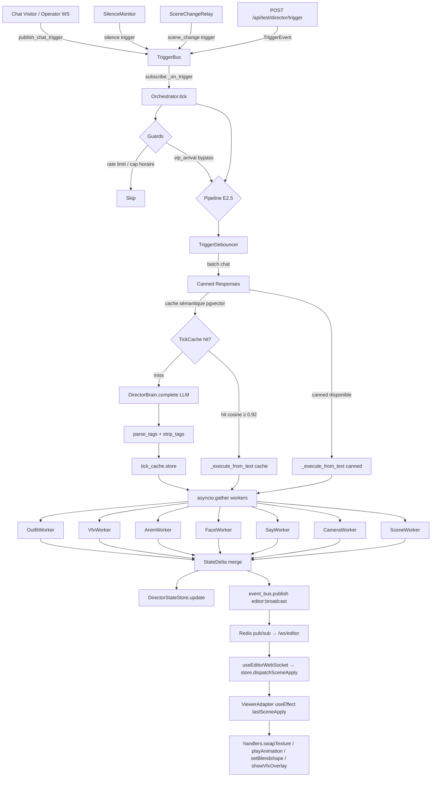

# Embodied Shugu — Architecture Soul/Shell (Phase E4)

Documentation complète de l'archi Embodied Shugu, de la boucle Soul/Shell au
scénario North Star Demo VIP.

---

## Vue d'ensemble

Embodied Shugu transforme le streamer en avatar IA réactif : les triggers
(chat, VIP, silence) déclenchent le **Soul** (LLM Director) qui commande
le **Shell** (workers déterministes) pour animer le viewer 3D en temps réel.

---

## Diagramme Mermaid — Soul/Shell Flow



---

## Flow d'un VIP arrival end-to-end (timing <3s)

```
t=0ms    visitor WS reçoit message de "Spoukie"
          → publish_chat_trigger(sender="spoukie") sur TriggerBus
          → publish_vip_arrival(sender="spoukie") sur TriggerBus (VIP whitelist match)

t=1ms    Orchestrator._on_trigger("vip_arrival") → tick()
          → vip_arrival BYPASS rate limit + cap horaire
          → acquiert _tick_lock

t=5ms    _execute_tick → pas de debounce (vip_arrival non debounceable)
          → _execute_tick_post_debounce

t=10ms   check canned_responses → aucune canned vip_arrival par défaut
          → DirectorStateStore.get() → SceneStateSnapshot avec assets_available seedé

t=30ms   format_trigger_for_cache("vip_arrival", {"sender":"spoukie"}, ...)
          → TickCache.lookup() → miss (1ère fois)

t=50ms   build_prompt(state, trigger) → system + user prompt MiniMax
          → DirectorBrain.complete(timeout=3s)

t=500ms  LLM MiniMax répond :
          "Spoukie !! [outfit:vip_celebration][face:joy][vfx:confetti_gold][anim:wave]"

t=510ms  parse_tags → [outfit:vip_celebration, face:joy, vfx:confetti_gold, anim:wave]
          strip_tags → "Spoukie !!"
          tick_cache.store(trigger_text, llm_text, tags)

t=515ms  asyncio.gather(
            OutfitWorker.apply("vip_celebration", state),
            FaceWorker.apply("joy", state),
            VfxWorker.apply("confetti_gold", state),
            AnimWorker.apply("wave", state),
          )

t=520ms  Chaque worker valide slug contre assets_available, puis :
          event_bus.publish("editor:broadcast", {type:"scene.apply", kind:"outfit", id:"vip_celebration"})
          event_bus.publish("editor:broadcast", {type:"scene.apply", kind:"face", id:"joy"})
          ...

t=520ms  DirectorStateStore.update({"outfit":"vip_celebration","face":"joy","active_vfx":[...]})

t=525ms  Redis pub/sub fanout → /ws/editor → useEditorWebSocket
          → store.dispatchSceneApply({kind:"outfit", id:"vip_celebration"})
          → ViewerAdapter useEffect → handlers.swapTexture("/assets/vrm/outfits/vip_celebration.png")
          → data-current-outfit="vip_celebration"

TOTAL: ~500-800ms (LLM MiniMax) — cible < 3s budget spec
```

---

## Comment ajouter un worker

1. Créer `backend/shugu/director/workers/<name>.py` avec une classe héritant de `Worker`.
2. Déclarer `tag_name = "<slug>"` correspondant au tag inline `[<slug>:value]`.
3. Implémenter `async def apply(self, tag_value: str, state: SceneStateSnapshot) -> StateDelta`.
4. Enregistrer dans `make_workers()` dans `backend/shugu/director/workers/__init__.py`.
5. Ajouter les tests unitaires dans `backend/tests/unit/test_director_workers.py`.

```python
# Exemple minimal
class ShaderWorker(Worker):
    tag_name = "shader"

    async def apply(self, tag_value: str, state: SceneStateSnapshot) -> StateDelta:
        if tag_value not in VALID_SHADERS:
            return StateDelta(patch={})
        await self._publish({"type": "scene.apply", "kind": "shader", "id": tag_value, ...})
        return StateDelta(patch={"shader": tag_value})
```

---

## Comment ajouter un trigger kind

1. Ajouter la valeur dans `TriggerKind` (`backend/shugu/director/triggers.py`).
2. Ajouter un publisher dans `wiring.py` si le trigger vient d'un WS handler.
3. Mettre à jour `DEBOUNCEABLE_KINDS` dans `debouncer.py` si applicable.
4. Mettre à jour `CANNED_ELIGIBLE_KINDS` dans `canned_responses.py` si des réponses canned font sens.
5. Mettre à jour le prompt `build_prompt()` dans `prompt.py` si besoin.

---

## Comment ajouter une canned response

Éditer `backend/shugu/director/canned_responses.py` :

```python
_CANNED: dict[TriggerKind, list[CannedResponse]] = {
    "silence": [
        CannedResponse(
            id="silence_meditate",
            text="[face:thinking][anim:thinking] Je médite...",
        ),
        # ... ajouter ici
    ],
}
```

Les canned responses sont sélectionnées aléatoirement parmi celles du kind,
en évitant les 8 dernières utilisées (déduplication via `_recent_canned_ids`).

---

## Comment étendre la bank d'assets

### Outfits (textures PNG)

1. Ajouter `<slug>.png` dans `frontend/public/assets/vrm/outfits/`.
2. Ajouter `"<slug>"` dans la liste `outfits` de `assets_available` dans `app.py` lifespan.
3. Le worker `OutfitWorker` validera automatiquement le nouveau slug.

### VFX (configs JSON)

1. Ajouter `<slug>.json` dans `frontend/public/assets/vfx/` avec `{type, color, density, duration_ms}`.
2. Ajouter `"<slug>"` dans la liste `vfx` de `assets_available`.

### Animations VRMA

1. Ajouter `<slug>.vrma` dans `frontend/public/assets/vrma/`.
2. Ajouter `"<slug>"` dans la liste `anims` de `assets_available`.

### Scènes

1. Ajouter `<slug>.json` dans `frontend/public/assets/scenes/`.
2. Ajouter `"<slug>"` dans la liste `scenes` de `assets_available`.

---

## Debug tricks

### Logs à chercher

```bash
# Orchestrator — pipeline complet
grep "director.orchestrator" logs.json

# Cache hit / miss
grep "director.orchestrator_cache_hit\|director.orchestrator_cache_miss" logs.json

# Worker invalid slug
grep "director.worker_outfit_invalid" logs.json

# Broadcast émis
grep "editor:broadcast" logs.json

# TriggerBus events
grep "trigger_bus" logs.json
```

### Variables d'env utiles

| Variable | Description | Défaut |
|---|---|---|
| `SHUGU_DIRECTOR_ENABLED` | Active le Director (Soul) | `false` |
| `SHUGU_VIP_USERNAMES` | Whitelist VIP CSV ou JSON | `[]` |
| `SHUGU_DIRECTOR_LLM_PROVIDER` | `minimax\|anthropic\|openai\|ollama` | `minimax` |
| `SHUGU_DIRECTOR_CACHE_ENABLED` | Cache sémantique pgvector | `true` |
| `SHUGU_DIRECTOR_CANNED_ENABLED` | Réponses canned silence/scene | `true` |
| `SHUGU_DIRECTOR_MAX_TICKS_PER_HOUR` | Cap horaire ticks LLM | `200` |
| `SHUGU_TEST_TRIGGERS_ENABLED` | Active POST /api/test/director/trigger | `false` |
| `MINIMAX_API_KEY` | Clé MiniMax pour le LLM Director | `` |
| `ANTHROPIC_API_KEY` | Clé Anthropic (fallback provider) | `` |

### Test local sans LLM (canned responses)

```bash
# Activer les canned responses + désactiver le cache (pour tester les canned uniquement)
SHUGU_DIRECTOR_ENABLED=true \
SHUGU_DIRECTOR_CANNED_ENABLED=true \
SHUGU_DIRECTOR_CACHE_ENABLED=false \
SHUGU_TEST_TRIGGERS_ENABLED=true \
uvicorn backend.shugu.app:app --reload

# Déclencher un silence trigger (canned disponible)
curl -X POST http://localhost:8701/api/test/director/trigger \
  -H "Content-Type: application/json" \
  -H "Cookie: shugu_access=<token>" \
  -d '{"kind": "silence", "payload": {"duration_s": 60}}'
```

### Activer le scénario VIP demo complet

```bash
# .env ou variables d'env
SHUGU_DIRECTOR_ENABLED=true
SHUGU_VIP_USERNAMES=spoukie,vip_alice
SHUGU_TEST_TRIGGERS_ENABLED=true
MINIMAX_API_KEY=<votre_clé>

# Seed les mémoires VIP demo
python -m backend.scripts.seed_director_demo

# Déclencher l'arrivée VIP
curl -X POST http://localhost:8701/api/test/director/trigger \
  -H "Content-Type: application/json" \
  -H "Cookie: shugu_access=<operator_jwt>" \
  -d '{"kind": "vip_arrival", "payload": {"sender": "spoukie"}}'
```

---

## Coût opérationnel

| Scénario | Appels LLM/h | Source d'économie |
|---|---|---|
| Sans cache ni canned | ~200 (max cap) | — |
| Avec debounce chat (3s window) | ~100 (-50%) | Batch chat bursts |
| + Canned (silence/scene) | ~85 (-57%) | Skip LLM sur events répétitifs |
| + Cache sémantique (0.92 cosine) | ~30-40 (-80-85%) | Réponse déjà connue |
| **Phase E2.5 combiné** | **~5-8k/jour** | vs ~43k sans cache |

Projection : 5-8k appels LLM/jour avec cache + canned + debounce sur un stream de 6h/jour actif.

---

## Limitations connues (Phase E4)

1. **OpenAI / Ollama providers** : squelettes présents dans `adapters/`, non testés en prod.
   Activer via `SHUGU_DIRECTOR_LLM_PROVIDER=openai|ollama`.

2. **Persona MVP hardcodée** : `assets_available` est une liste statique dans le lifespan.
   Phase E5 : lecture dynamique depuis le filesystem ou une table DB.

3. **say_emotion TTS** : le tag `[say_emotion:neutral]` est un no-op visuel côté viewer.
   La variation de voix TTS est hors scope Phase E4.

4. **Camera mode** : `[camera:close_up]` est loggué mais pas câblé au store viewer.
   Gap spec ↔ implé documenté dans `viewer-adapter.tsx`.

5. **swapTexture / playAnimation** : stubs no-ops en Phase F. Les vrais appels Three.js
   attendent que le viewer legacy expose ses primitives (`swapTexture`, `playAnimation`).

6. **data-active-vfx-count** : compteur incrémental depuis le boot, pas une liste
   de VFX actifs courante. Un VFX terminé (après `duration_ms`) n'est pas décrémenté.

7. **VRMA placeholders** : les fichiers `.vrma` dans `public/assets/vrma/` sont des
   fichiers vides. Le viewer aura des erreurs GLTF silencieuses — comportement voulu
   jusqu'à la livraison des vrais assets.

---

## Références

- `backend/shugu/director/orchestrator.py` — boucle Soul E2.5
- `backend/shugu/director/workers/` — workers Shell E3
- `backend/shugu/director/wiring.py` — helpers de publication
- `backend/shugu/director/background.py` — SilenceMonitor + SceneChangeRelay
- `backend/shugu/app.py` — lifespan wiring complet
- `backend/shugu/routes/test_director_api.py` — route de test E4
- `frontend/src/features/scene-editor/viewer-adapter.tsx` — consommateur frontend
- `frontend/e2e/embodied-shugu-vip.spec.ts` — test E2E North Star
- `docs/SCENE-EDITOR-EMBODIED-ASSETS.md` — convention assets bank
