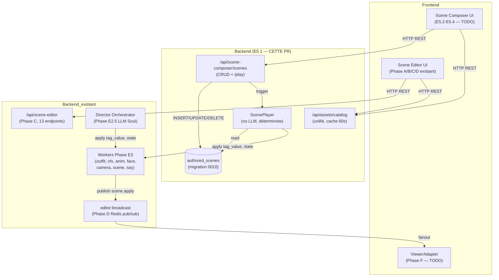
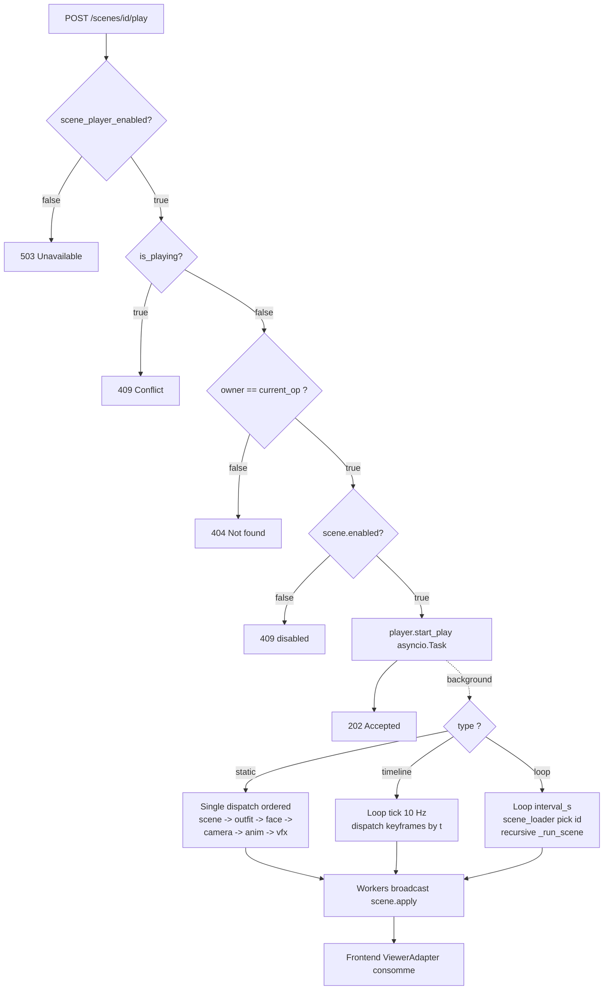
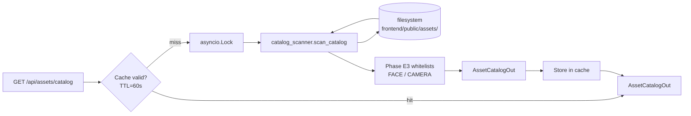

# Scene Composer — Architecture (Phase E5.x)

## Vision

Le **Scene Composer** est un éditeur 3D simple/intuitif (style Spline) qui
complémente le **Scene Editor** Unity-like existant. Les deux outils sont
volontairement séparés :

| Outil           | Public         | Usage                                                  | Complexité |
|-----------------|----------------|--------------------------------------------------------|------------|
| Scene Editor    | Power user     | Édition fine, dock panels, timeline, patterns, drafts  | Élevée     |
| Scene Composer  | Operator/régie | Authoring de scenes pré-fabriquées + Play Mode + AFK   | Faible     |

L'objectif principal : **économie LLM massive** (~70% du temps stream solo)
via les **AFK loops** — des scenes scriptées qui s'exécutent en boucle
quand 0 viewer, sans aucun appel Director Soul.

## Phase E5.1 — Backend Foundation (cette PR)



## Schéma `authored_scenes` (migration 0010)

```sql
CREATE TABLE authored_scenes (
    id                  VARCHAR(26) PRIMARY KEY,    -- ULID
    name                VARCHAR(80) NOT NULL,
    description         TEXT,
    type                VARCHAR(16) NOT NULL,       -- static | timeline | loop
    triggers            JSONB NOT NULL DEFAULT '[]',
    static_state        JSONB,                       -- pour type=static
    timeline_keyframes  JSONB,                       -- pour type=timeline
    loop_config         JSONB,                       -- pour type=loop
    owner_username      VARCHAR(64) NOT NULL,
    enabled             BOOLEAN NOT NULL DEFAULT TRUE,
    created_at          TIMESTAMPTZ NOT NULL DEFAULT NOW(),
    updated_at          TIMESTAMPTZ NOT NULL DEFAULT NOW(),

    CONSTRAINT chk_authored_scenes_type
        CHECK (type IN ('static', 'timeline', 'loop')),
    CONSTRAINT chk_authored_scenes_content
        CHECK (
            (type = 'static'   AND static_state IS NOT NULL)
            OR (type = 'timeline' AND timeline_keyframes IS NOT NULL)
            OR (type = 'loop'     AND loop_config IS NOT NULL)
        )
);
CREATE UNIQUE INDEX ix_authored_scenes_owner_name ON authored_scenes (owner_username, name);
CREATE INDEX ix_authored_scenes_enabled ON authored_scenes (owner_username) WHERE enabled = TRUE;
CREATE INDEX ix_authored_scenes_type ON authored_scenes (type);
```

**Différences vs `scene_drafts` (Phase C)** :
- `scene_drafts` versionne l'**état de l'éditeur Unity** (snapshots avant publication).
- `authored_scenes` stocke des **scenes exécutables** (Play Mode + AFK loops).
- Single-writer rule : seul `routes/scene_composer_api.py` écrit dans
  `authored_scenes` ; le ScenePlayer ne fait que lire.

## Triggers — types et sémantique

| Kind                  | Phase | Sémantique                                             |
|-----------------------|-------|--------------------------------------------------------|
| `manual`              | E5.1  | Déclenché via POST `/scenes/{id}/play`                 |
| `viewer_count_below`  | E5.4  | Auto-trigger quand viewer count < `threshold`          |
| `silence_for`         | E5.4  | Auto-trigger après N `seconds` sans chat               |
| `schedule_cron`       | E5.4  | Trigger horaire via expression cron                    |
| `stream_event`        | E5.4  | Trigger Twitch (intro/outro/raid/follow/subscribe)     |

Phase E5.1 wire **uniquement** `manual`. Les autres sont validés et
persistés mais leur runtime auto-detector arrive en E5.4.

## ScenePlayer — flow d'exécution



Garde-fous :
- `scene_player_enabled=False` (défaut) → no-op silencieux + log warning.
- 1-at-a-time : `start_play` raise `SceneAlreadyPlayingError` si déjà actif.
- Cancel propre : `stop_current()` annule la task asyncio sans plant.
- Worker exception ne tue PAS le player (log + continue).
- Anti-récursion loop : sub-scene de type `loop` est skippée.

## Asset Catalog API



Sections :
- `vrm_avatars` : `assets/vrm/*.vrm` + sidecars `*.vrma`.
- `outfits` : `assets/vrm/outfits/*.png`.
- `vrma_animations` : `assets/vrma/*.vrma` + meta JSON optionnel.
- `vfx` : `assets/vfx/*.json`.
- `scenes` : `assets/scenes/*.json`.
- `props_3d` : `assets/props/*.glb` (placeholder Phase E5.3 — vide MVP).
- `faces` : whitelist Phase E3 `FACE_WHITELIST`.
- `camera_modes` : whitelist Phase E3 `CAMERA_WHITELIST`.

## Modules backend créés

| Module                                              | Responsabilité                                  |
|-----------------------------------------------------|-------------------------------------------------|
| `alembic/versions/0010_authored_scenes.py`          | Migration up/down                               |
| `db/models_scene_composer.py`                       | ORM `AuthoredSceneRow` (séparé de `models.py`)  |
| `domain/scene_composer_schemas.py`                  | Pydantic v2 + discriminated union               |
| `domain/assets_catalog_schemas.py`                  | Schemas catalogue assets                        |
| `routes/scene_composer_api.py`                      | REST CRUD + /play endpoint                      |
| `routes/assets_catalog_api.py`                      | Endpoint catalogue + cache 60s                  |
| `scene_composer/__init__.py`                        | Package isolé                                   |
| `scene_composer/catalog_scanner.py`                 | Scanner filesystem (pure-function)              |
| `scene_composer/player.py`                          | ScenePlayer déterministe                        |

Cette séparation respecte la discipline modulaire : 1 fichier ≈ 1 responsabilité,
≤ 500 lignes par fichier, docstrings FR pour toute classe/fonction publique.

## Roadmap E5.2-E5.5

- **E5.2** : Frontend Scene Composer — port Figma_mini 3D, gizmos drag-drop.
- **E5.3** : Pipeline props 3D GLB — ingestion + preview + thumbnails.
- **E5.4** : Auto-detector triggers (viewer_count_below, silence_for,
  schedule_cron, stream_event) → ScenePlayer.start_play() automatique.
- **E5.5** : Bridge Scene Editor ↔ Scene Composer via shared `scene_drafts`
  (export Editor → import Composer comme `static`).

## Feature flag rollout

```bash
# Activation progressive (opt-in) :
SHUGU_SCENE_PLAYER_ENABLED=true
```

Tant que le flag est OFF :
- L'API CRUD reste fonctionnelle (création/édition de scenes possible).
- L'API `/play` retourne **503** (le ScenePlayer n'est pas wiré).
- Aucune surface d'attaque ouverte en prod.

## Sécurité

- **IDOR** : tous les endpoints filtrent par `owner_username`. Un opérateur
  qui tente de GET/PUT/DELETE/play une scene d'un autre opérateur reçoit
  un 404 (pas 403, pour ne pas leak l'existence).
- **Slug validation** : tout slug d'asset reçu via API est validé contre
  la regex stricte `^[a-zA-Z0-9_-]+$` (cohérent avec Phase E3 SCENE_ID_PATTERN).
- **Single-writer rule** : invariant doc — seul `scene_composer_api.py`
  écrit dans `authored_scenes`. Tout autre INSERT/UPDATE/DELETE casse les
  invariants IDOR + content-matches-type.
- **No leak SQL** : `_describe_integrity_error` parse les noms de
  contraintes (jamais le SQL brut), comme Phase C.

## Tests

- **Unit** : 69 tests verts (schemas 24, API 24, catalog 9, player 12).
- **Integration** : 4 tests skip propre sans Postgres, vérifient migration
  + roundtrip DB sinon.
- **Régression** : 628 unit tests verts (baseline 559 + 69 nouveaux).

## Liens

- `backend/shugu/scene_composer/` — package isolé.
- `backend/shugu/routes/scene_composer_api.py` — REST API CRUD.
- `backend/shugu/routes/assets_catalog_api.py` — Asset Catalog endpoint.
- `backend/alembic/versions/0010_authored_scenes.py` — migration.
- `backend/tests/unit/test_scene_composer_*.py` — tests unitaires.
- `backend/tests/integration/test_scene_composer_db.py` — tests intégration.
