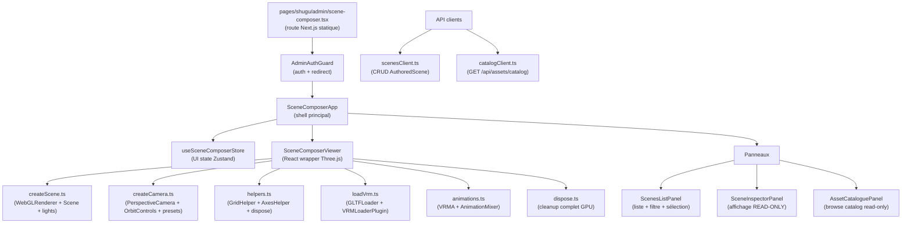
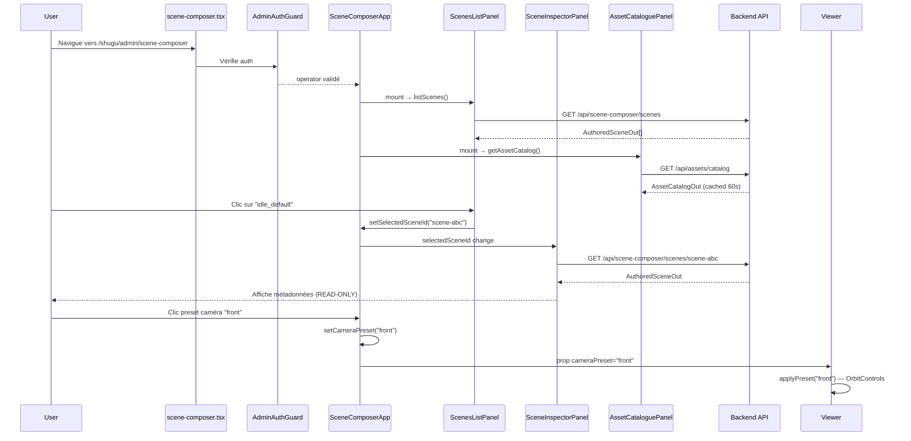

# Scene Composer Frontend — Phase E5.2

Documentation de l'implémentation du Scene Composer frontend.

## Architecture

## Modules

### Route

| Fichier | Description |
|---|---|
| `pages/shugu/admin/scene-composer.tsx` | Route statique Next.js, AdminAuthGuard, dynamic import ssr:false |

**Note route statique** : la route est sous `/shugu/admin/` (pas `[username]/admin/`)
car `AdminAuthGuard` hardcode un redirect vers `/${username}/admin/scene-editor`
sur mismatch d'username, ce qui créerait une boucle si le Composer était sous
`[username]/admin/scene-composer`. Cohérent avec `scene-editor-popout.tsx`.

### Shell

| Fichier | Description |
|---|---|
| `features/scene-composer/SceneComposerApp.tsx` | Shell principal (toolbar + layout 3 colonnes) |
| `features/scene-composer/index.ts` | Barrel export |

### Viewer Three.js (modules purs)

| Module | Lignes | Responsabilité |
|---|---|---|
| `viewer/three-stage/createScene.ts` | ~85 | WebGLRenderer + Scene + éclairage + sol |
| `viewer/three-stage/createCamera.ts` | ~80 | PerspectiveCamera + OrbitControls + presets |
| `viewer/three-stage/helpers.ts` | ~70 | GridHelper + AxesHelper + dispose explicite |
| `viewer/three-stage/loadVrm.ts` | ~95 | GLTFLoader + VRMLoaderPlugin + cancel token |
| `viewer/three-stage/animations.ts` | ~80 | VRMA + AnimationMixer (via lib VRMAnimation) |
| `viewer/three-stage/dispose.ts` | ~100 | Cleanup complet GPU/CPU au unmount |
| `viewer/SceneComposerViewer.tsx` | ~180 | Wrapper React (lifecycle mount/unmount/resize) |

### Store

| Fichier | État géré |
|---|---|
| `store/useSceneComposerStore.ts` | `selectedSceneId`, `viewerMode`, `cameraPreset`, `panelLayout` |

**Pattern** : Zustand sans middleware temporal (UI seulement, pas d'undo/redo
en E5.2). Selectors granulaires exportés pour éviter les re-renders inutiles.

### API Clients

| Client | Endpoints |
|---|---|
| `api/scenesClient.ts` | `GET/POST /api/scene-composer/scenes`, `GET/PUT/DELETE /:id`, `POST /:id/play` |
| `api/catalogClient.ts` | `GET /api/assets/catalog` |

**Pattern** : `request<T>` helper local avec `credentials: "include"` (cookies httpOnly),
identique à `services/accountClient.ts`. Erreurs typées (`ScenesClientError`, `CatalogClientError`).

### Panneaux

| Panneau | Description |
|---|---|
| `panels/ScenesListPanel.tsx` | Liste scènes + filtre texte + sélection → store |
| `panels/SceneInspectorPanel.tsx` | Affichage READ-ONLY de la scène sélectionnée (JSON pour champs complexes) |
| `panels/AssetCataloguePanel.tsx` | Browse catalog assets avec sections repliables |

**Note SceneInspectorPanel** : les champs complexes (`triggers`, `static_state`,
`timeline_keyframes`, `loop_config`) sont affichés en JSON formaté intentionnellement
pour E5.2. L'éditeur structuré (discriminated union TriggerSpec, etc.) est planifié E5.3.

## User Flow

## Décisions techniques

### Route statique `/shugu/admin/`

Voir `AdminAuthGuard.tsx` ligne 96 — redirect hardcodé vers `/${username}/admin/scene-editor`.
La route statique évite tout conflit avec ce redirect.

### OrbitControls vs lerp manuel

Figma_mini (StreamStage) utilisait un lerp caméra manuel. Phase E5.2 utilise
OrbitControls (standard Three.js) pour l'ergonomie (zoom souris, pan, rotate
clic-glisser) et la cohérence avec `SceneEditorViewer` legacy.

### VRMAnimation vs poseVrm

Figma_mini n'avait pas de support VRMA — `poseVrm` effectuait des rotations d'os
manuelles non portables. E5.2 utilise `lib/VRMAnimation/loadVRMAnimation.ts` +
`VRMAnimation.createAnimationClip(vrm)` (spec VRMA standard).

### Dispose pattern (Phase F lesson)

`scene.remove(helper)` seul ne libère pas la mémoire GPU. `helpers.ts` appelle
explicitement `helper.geometry.dispose()` et `helper.material.dispose()`.
Vérifié par le test `SceneComposerViewer.test.tsx` via spy `BufferGeometry.prototype.dispose`.

### Three.js r149 compatibility

`outputEncoding = 3001` (sRGBEncoding) au lieu de `outputColorSpace = THREE.SRGBColorSpace`
(ajouté en r152). Pas de bump de version nécessaire — Three.js r149 est identique
entre Figma_mini et Shugu_stream.

## Tests

50 tests Vitest, 5 fichiers :

| Fichier | Tests | Couverture |
|---|---|---|
| `SceneComposerViewer.test.tsx` | 9 | Dispose helpers, RAF cancel, stabilité remount |
| `useSceneComposerStore.test.ts` | 13 | État initial, actions, resetUI, selectors |
| `scenesClient.test.ts` | 9 | CRUD complet + ScenesClientError |
| `catalogClient.test.ts` | 6 | getAssetCatalog + CatalogClientError |
| `panels.test.tsx` | 13 | ScenesListPanel, SceneInspectorPanel, AssetCataloguePanel |

## Scope E5.2 vs roadmap

| Feature | Phase |
|---|---|
| Port StreamStage → 6 modules Three.js | **E5.2 ✓** |
| Viewer 3D + OrbitControls | **E5.2 ✓** |
| Store UI (sélection, mode, preset, layout) | **E5.2 ✓** |
| API clients typés (CRUD + catalog) | **E5.2 ✓** |
| 3 panneaux read-only | **E5.2 ✓** |
| Gizmos / TransformControls | E5.3 |
| Drag-drop assets | E5.3 |
| Éditeur structuré triggers/states | E5.3 |
| Play Mode toolbar animée | E5.4 |
| Bridge Scene Editor ↔ Scene Composer | E5.5 |
