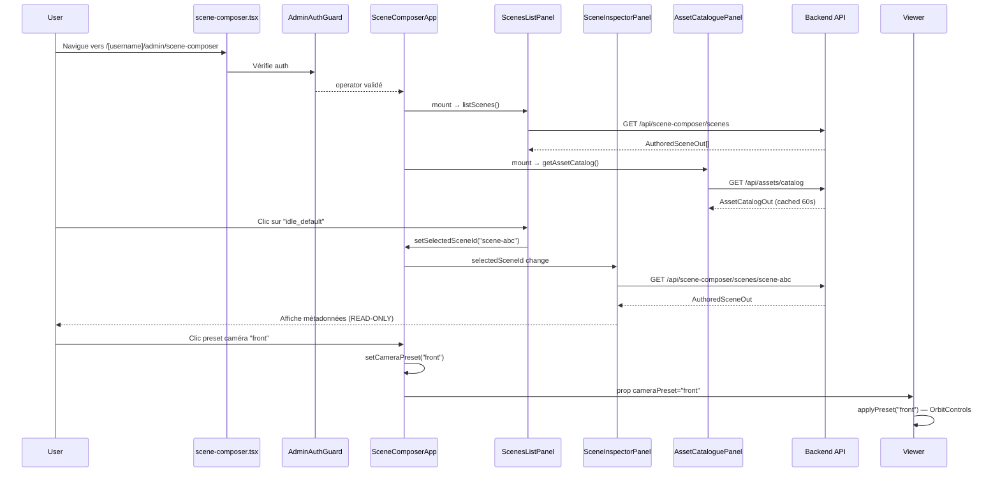
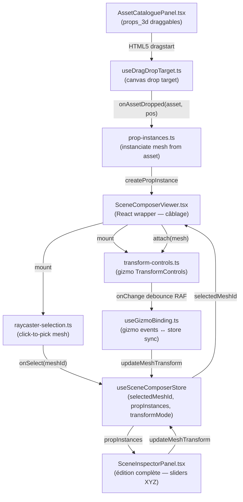
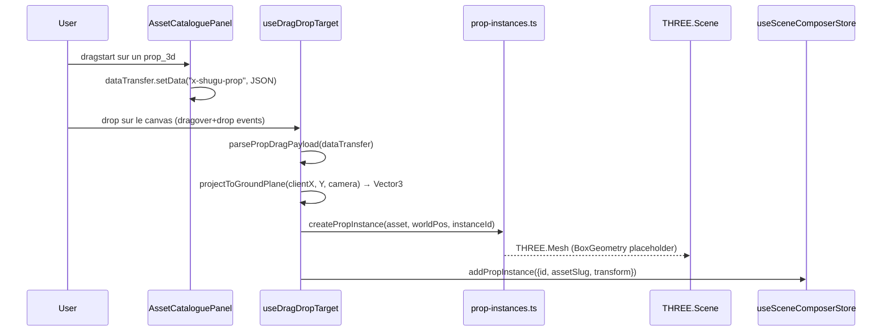
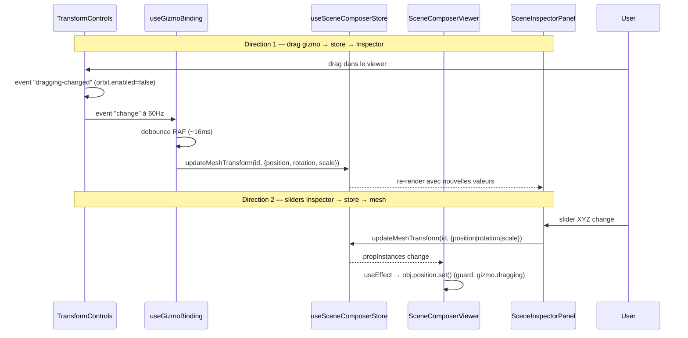

> **⚠️ Document obsolète**
>
> Cette doc décrit une ancienne architecture (`SceneComposerApp`).
> Le code vivant est dans `frontend/src/features/scene-editor-v2/`.
> Naming canonique : **Scene Studio** (UI) / `scene-editor-v2` (code).
>
> Conservé en référence historique. Ne pas suivre les recommandations
> de ce document pour de nouveaux développements.

# Scene Composer Frontend — Phase E5.2

Documentation de l'implémentation du Scene Composer frontend.

## Architecture


## Modules

### Route

| Fichier | Description |
|---|---|
| `pages/[username]/admin/scene-composer.tsx` | **Route officielle** dynamic Next.js (alignement pattern `scene-editor.tsx`), AdminAuthGuard, dynamic import ssr:false |
| `pages/shugu/admin/scene-composer.tsx` | Route legacy → redirect 308 vers `/${username}/admin/scene-composer` (server-side via `getServerSideProps` + fallback client) |

**Note alignement** (fix M2 PR #26) : avant la review, la route était sous
`/shugu/admin/scene-composer` (statique) — incohérent avec `scene-editor.tsx`
qui est sous `[username]/admin/`. M2 aligne sur le pattern dynamic et conserve
l'ancienne route comme alias redirect (compat bookmarks). Le redirect mismatch
d'`AdminAuthGuard` ligne 96 cible toujours `scene-editor` — un fix transverse
pour préserver le path est listé en TODO mais hors scope M2.

### Shell

| Fichier | Description |
|---|---|
| `features/scene-composer/SceneComposerApp.tsx` | Shell principal (toolbar + layout 3 colonnes) |
| `features/scene-composer/index.ts` | Barrel export |

### Viewer Three.js (modules purs)

| Module | Lignes | Responsabilité |
|---|---|---|
| `viewer/three-stage/createScene.ts` | ~85 | WebGLRenderer + Scene + éclairage + sol |
| `viewer/three-stage/createCamera.ts` | ~80 | PerspectiveCamera + OrbitControls + presets |
| `viewer/three-stage/helpers.ts` | ~70 | GridHelper + AxesHelper + dispose explicite |
| `viewer/three-stage/loadVrm.ts` | ~95 | GLTFLoader + VRMLoaderPlugin + cancel token |
| `viewer/three-stage/animations.ts` | ~80 | VRMA + AnimationMixer (via lib VRMAnimation) |
| `viewer/three-stage/dispose.ts` | ~100 | Cleanup complet GPU/CPU au unmount |
| `viewer/SceneComposerViewer.tsx` | ~180 | Wrapper React (lifecycle mount/unmount/resize) |

### Store

| Fichier | État géré |
|---|---|
| `store/useSceneComposerStore.ts` | `selectedSceneId`, `viewerMode`, `cameraPreset`, `panelLayout` |

**Pattern** : Zustand sans middleware temporal (UI seulement, pas d'undo/redo
en E5.2). Selectors granulaires exportés pour éviter les re-renders inutiles.

### API Clients

| Client | Endpoints |
|---|---|
| `api/scenesClient.ts` | `GET/POST /api/scene-composer/scenes`, `GET/PUT/DELETE /:id`, `POST /:id/play` |
| `api/catalogClient.ts` | `GET /api/assets/catalog` |

**Pattern** : `request<T>` helper local avec `credentials: "include"` (cookies httpOnly),
identique à `services/accountClient.ts`. Erreurs typées (`ScenesClientError`, `CatalogClientError`).

### Panneaux

| Panneau | Description |
|---|---|
| `panels/ScenesListPanel.tsx` | Liste scènes + filtre texte + sélection → store |
| `panels/SceneInspectorPanel.tsx` | Affichage READ-ONLY de la scène sélectionnée (JSON pour champs complexes) |
| `panels/AssetCataloguePanel.tsx` | Browse catalog assets avec sections repliables |

**Note SceneInspectorPanel** : les champs complexes (`triggers`, `static_state`,
`timeline_keyframes`, `loop_config`) sont affichés en JSON formaté intentionnellement
pour E5.2. L'éditeur structuré (discriminated union TriggerSpec, etc.) est planifié E5.3.

## User Flow



## Décisions techniques

### Route statique `/shugu/admin/`

Voir `AdminAuthGuard.tsx` ligne 96 — redirect hardcodé vers `/${username}/admin/scene-editor`.
La route statique évite tout conflit avec ce redirect.

### OrbitControls vs lerp manuel

Figma_mini (StreamStage) utilisait un lerp caméra manuel. Phase E5.2 utilise
OrbitControls (standard Three.js) pour l'ergonomie (zoom souris, pan, rotate
clic-glisser) et la cohérence avec `SceneEditorViewer` legacy.

### VRMAnimation vs poseVrm

Figma_mini n'avait pas de support VRMA — `poseVrm` effectuait des rotations d'os
manuelles non portables. E5.2 utilise `lib/VRMAnimation/loadVRMAnimation.ts` +
`VRMAnimation.createAnimationClip(vrm)` (spec VRMA standard).

### Dispose pattern (Phase F lesson)

`scene.remove(helper)` seul ne libère pas la mémoire GPU. `helpers.ts` appelle
explicitement `helper.geometry.dispose()` et `helper.material.dispose()`.
Vérifié par le test `SceneComposerViewer.test.tsx` via spy `BufferGeometry.prototype.dispose`.

### Three.js r149 compatibility

`outputEncoding = 3001` (sRGBEncoding) au lieu de `outputColorSpace = THREE.SRGBColorSpace`
(ajouté en r152). Pas de bump de version nécessaire — Three.js r149 est identique
entre Figma_mini et Shugu_stream.

## Tests

50 tests Vitest, 5 fichiers :

| Fichier | Tests | Couverture |
|---|---|---|
| `SceneComposerViewer.test.tsx` | 9 | Dispose helpers, RAF cancel, stabilité remount |
| `useSceneComposerStore.test.ts` | 13 | État initial, actions, resetUI, selectors |
| `scenesClient.test.ts` | 9 | CRUD complet + ScenesClientError |
| `catalogClient.test.ts` | 6 | getAssetCatalog + CatalogClientError |
| `panels.test.tsx` | 13 | ScenesListPanel, SceneInspectorPanel, AssetCataloguePanel |

## Scope E5.2 / E5.3 vs roadmap

| Feature | Phase |
|---|---|
| Port StreamStage → 6 modules Three.js | **E5.2 ✓** |
| Viewer 3D + OrbitControls | **E5.2 ✓** |
| Store UI (sélection, mode, preset, layout) | **E5.2 ✓** |
| API clients typés (CRUD + catalog) | **E5.2 ✓** |
| 3 panneaux read-only | **E5.2 ✓** |
| Gizmos TransformControls (W/E/R) | **E5.3 ✓** |
| Click-to-select mesh (raycaster) | **E5.3 ✓** |
| Drag-drop assets props_3d → canvas | **E5.3 ✓** |
| Inspector édition complète (sliders XYZ) | **E5.3 ✓** |
| Bidirectionnel gizmo ↔ Inspector | **E5.3 ✓** |
| Play Mode toolbar animée | E5.4 |
| AFK loops / idle animations | E5.4 |
| Chargement glTF réel (props_3d) | E5.4 |
| Bridge Scene Editor ↔ Scene Composer | E5.5 |

## Interactivité 3D — Phase E5.3

### Architecture modules purs E5.3



### Flow drag-drop



### Bidirectionnel gizmo ↔ Inspector



### OrbitControls + TransformControls coexistence

Pattern porté depuis `SceneEditorViewer.tsx` (Phase F legacy) :

1. **Désactivation pendant drag** : `dragging-changed` event → `orbit.enabled = !dragging`.
   Pendant qu'un gizmo est draggé, OrbitControls est désactivé pour éviter que
   les deux contrôleurs se disputent les événements souris.

2. **Réactivation au drop** : `dragging-changed(false)` → `orbit.enabled = true`.

3. **Feedback loop prevention** : quand l'Inspector modifie le store et que le
   useEffect du viewer ré-applique la position sur le mesh, on vérifie
   `gizmoHandle.controls.dragging === true` avant d'appliquer — si le gizmo est
   en cours de drag, on ignore le write de l'inspector (sinon jitter).

### Dispose pattern E5.3 (Phase F lesson)

Les modules E5.3 retournent chacun leur propre `dispose()` :

```
unmount cleanup order:
1. selectionHandle.dispose()        — retire listener pointerdown
2. disposePropInstance(obj) ×N      — geometry + material + textures
3. gizmoHandle.dispose()            — detach → remove from scene → controls.dispose()
4. disposeAll({...})                — baseline E5.2 (renderer, VRM, helpers)
```

**Ordre critique** : `controls.detach()` avant `controls.dispose()` (r149 API).
`scene.remove(controls)` avant `renderer.dispose()` (libère les buffers GL).

### Scope décisions E5.3

- **props_3d seulement draggables** : VRM/VRMA/VFX/scenes ont des sémantiques
  à définir en E5.4+ (quel avatar recevoir un VRMA drop ? quelle zone une scene ?).
  Les assets non-props restent en lecture seule dans le catalogue.
- **BoxGeometry placeholder** : les props 3D sont des cubes colorés. Le chargement
  glTF réel via `GLTFLoader` est prévu en E5.4 quand les fichiers `.glb` seront
  dans le catalogue serveur.
- **Ground plane infini** : la projection drop utilise `THREE.Plane(Y=0)` (plan
  infini) plutôt que la CircleGeometry du sol (rayon 3m) — évite les drops
  silencieux en dehors du cercle.

## Tests — E5.2 + E5.3

244 tests Vitest, 18 fichiers (baseline E5.2 : 176 tests) :

| Fichier | Tests | Couverture |
|---|---|---|
| `three-stage/__tests__/transform-controls.test.ts` | 10 | Handle, setMode, attach, dispose, events |
| `three-stage/__tests__/raycaster-selection.test.ts` | 8 | Sélection, filtres, groupe, dispose |
| `three-stage/__tests__/prop-instances.test.ts` | 10 | Create, options, dispose round-trip |
| `interactions/__tests__/useGizmoBinding.test.ts` | 9 | RAF debounce, rotation°, sync store |
| `interactions/__tests__/useDragDropTarget.test.ts` | 8 | Dragover, drop, disabled, unmount |
| `__tests__/useSceneComposerStore.test.ts` | 25 | E5.2 + E5.3 (selectedMeshId, propInstances, etc.) |
| _(baseline E5.2 — 6 fichiers)_ | 174 | Inchangés ✓ |
