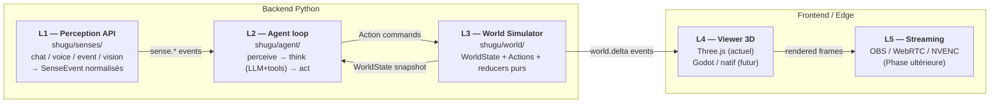

# Streamer IA — Architecture en 5 Layers — Fondation L0

> Status : Foundation L0 livrée. L1 functional, L2 loop, L3 reducers/publisher
> à venir en sous-PRs séquentielles.

## 1. Vue d'ensemble

Le streamer IA autonome est découpé en **5 layers** strictement isolés. Chaque
layer expose une frontière publique étroite (DTOs frozen + un petit nombre de
fonctions). Les layers de plus haut numéro consomment ceux de plus bas, **jamais
l'inverse**. Cette discipline rend chaque couche remplaçable indépendamment.



### Pourquoi cette séparation ?

| Frontière | Bénéfice |
|---|---|
| L1 ⊥ L2 | Mock perception en test, replay déterministe d'une trace de stream. |
| L2 ⊥ L3 | Replay LLM avec un World figé ; A/B test de personas sans toucher world. |
| L3 ⊥ L4 | **Swap viewer** Three.js → Godot → natif sans toucher le backend. |
| L4 ⊥ L5 | Streaming pipe est une consommation passive du frame buffer L4. |

Si L3 dépendait directement du viewer, swapper le moteur graphique = refonte
complète. Le découpage en commandes (`Action`) + diffs sur event_bus rend L4
**dérivé** de L3, jamais source de vérité.

## 2. État de la livraison L0 (cette PR)

L0 livre **uniquement les types publics** des 3 layers backend (L1, L2, L3).
Pas encore de logique runtime (pas de boucle agent active, pas de reducer
appliquant des actions, pas de publisher diff'ant). C'est volontaire :

- **L0 = contrats + arch tests** → permet d'enforcer les frontières dès la
  première ligne de code, pas après.
- Les implémentations runtime arrivent en **L1.x / L2.x / L3.x** dédiées,
  chacune avec sa propre PR squashée (cf. `feedback_modular_architecture.md`).

### Modules créés

```
backend/shugu/
├── senses/                  # L1
│   ├── __init__.py          # API publique : SenseEvent, SenseKind
│   └── types.py             # SenseEvent (frozen), SenseKind Literal
├── agent/                   # L2
│   ├── __init__.py          # API publique : Perception, Thought
│   ├── types.py             # Perception, Thought (frozen)
│   └── tools.py             # Tool, ToolRegistry (single-writer)
└── world/                   # L3
    ├── __init__.py          # API publique : WorldState, Action*, ActionUnion
    └── types.py             # WorldState + 4 variants Action (frozen)
```

### Tests d'architecture (enforcement statique)

`backend/tests/unit/test_arch_layers_l0.py` parse les imports en AST et
échoue si :

1. **Règle 1** : `senses/` importe `agent` ou `world`.
2. **Règle 2** : `agent/` importe `world` (sauf `world.types` — DTOs publics).
3. **Règle 3** : `world/` importe `senses` ou `agent`.
4. **Règle 4** : N'importe quel layer importe `scene_composer` (viewer-specific L4).

Le test scanne automatiquement tous les nouveaux fichiers `.py` ajoutés dans
ces dossiers — pas de maintenance à faire pour étendre la couverture.

### Tests des contrats (frozen + single-writer)

| Fichier | Couverture |
|---|---|
| `test_senses_types.py` | SenseEvent frozen, kinds fermés, topic, sérialisation bus |
| `test_agent_types.py` | Perception/Thought frozen, ToolRegistry single-writer + tri |
| `test_world_types.py` | WorldState frozen, 4 Action variants frozen, ActionUnion exposé |

**22 tests verts**, ruff clean.

## 3. Décisions de design verrouillées en L0

### D1. Frozen dataclasses pour TOUT type traversant les frontières

Pas de Pydantic en L0 : les types sont des dataclasses stdlib avec
`frozen=True, slots=True`. Justifications :

- **Replay déterministe** : un événement perçu en T=0 doit être identique
  s'il est rejoué.
- **Mutabilité bloquée** : `frozen=True` empêche la réassignation des champs.
  Pour les champs `Mapping` (payload, params_schema), on ajoute un
  `__post_init__` qui wrap dans `types.MappingProxyType(dict(...))` pour (a)
  bloquer `obj.field[k] = ...` et (b) isoler des mutations sur le dict
  d'origine. Copie superficielle uniquement — convention "scalars only" pour
  les payloads de senses, pas de deep-freeze coûteux Phase 1.
- **Pas hashable** : conséquence du `Mapping` field (même via MappingProxy).
  Pas un problème : la déduplication côté memory se fait par `(subject, ts)`,
  pas par hash de l'event.
- **Pas de validation runtime lourde** : Phase L0 n'a pas besoin de
  validation au boundary externe (pas d'API HTTP qui ingère des DTOs L0).
  Si un L1.x ajoute un endpoint qui reçoit du JSON, on adapte.

### D2. Closed sum d'Actions (multiple dataclasses) plutôt qu'Action générique

```python
# ❌ Choix rejeté
class Action:
    kind: str
    data: dict

# ✅ Choix retenu
@dataclass(frozen=True, slots=True)
class AvatarPoseAction:
    pose: str

@dataclass(frozen=True, slots=True)
class SceneTransitionAction:
    target_scene_id: str

ActionUnion = Union[AvatarPoseAction, SceneTransitionAction, ...]
```

- mypy/pyright peut faire de l'**exhaustiveness checking** sur un `match`
  (un variant manquant échoue au type-check, pas au runtime).
- Chaque variant a ses champs typés (pas de `data["scene_id"]` non typé).
- `to_bus_dict()` par variant contrôle la sérialisation JSON.

### D3. ToolRegistry single-writer

`register(tool)` lève `ValueError` si le nom existe déjà. Refuser un
double-register silencieux est cohérent avec la **single-writer rule**
appliquée ailleurs (cf. `feedback_modular_architecture.md`,
`test_arch_memory_isolation.py`). Caller qui veut explicitement remplacer :
`unregister(name)` puis `register(...)`.

### D4. `agent` peut importer `world.types` (DTOs) mais pas `world.state` (impl)

L'agent (L2) doit pouvoir typer ses signatures avec `WorldState` et émettre
des `Action*`. Mais il ne doit **jamais** muter le world directement —
l'application des actions passe par une fonction injectée (`apply: Callable`)
qui sera fournie par le wiring `app.py`. Le test arch enforce cette règle
via une allowlist explicite (`ALLOWED_TYPES_IMPORTS`).

### D5. Genesis-Embodied-AI parqué pour offline-only

[Genesis](https://github.com/Genesis-Embodied-AI/Genesis) (~8GB CUDA,
physique différentiable) ne sera **pas** intégré en runtime. Évalué et
rejeté pour le runtime VTuber :

- Mismatch d'usage : conçu pour training robotique, pas streaming 24/7.
- Couplage GPU lourd qui conflite avec rendu Three.js + STT + futur NVENC.
- L3 d'un VTuber n'a besoin que de poses scriptées + transitions
  déterministes, pas de rigid-body dynamics.

**Usage offline futur possible** : générer des animations procédurales VRMA
(shoulder shrug, danse rythmée) → exporter → ingérer dans la `vrma_bank`
existante. L'architecture L0 garde la porte ouverte (Action variant
`AvatarPoseAction` consomme un identifiant logique, indépendant du moteur
qui a produit l'animation).

## 4. Roadmap post-L0

| Étape | Module | Contenu |
|---|---|---|
| **L1.1** | `senses/bus.py` | `publish_sense_event(bus, ev)` + tests intégration event_bus |
| **L1.2** | `senses/sources/` | Adapters chat/voice/event existants → `SenseEvent` |
| **L2.1** | `agent/loop.py` | `AgentLoop.tick()` skeleton (perceive sans LLM) |
| **L2.2** | `agent/loop.py` | Branchement LLM + tool dispatch |
| **L3.1** | `world/reducers.py` | `apply(state, action) -> new_state` pur, par variant |
| **L3.2** | `world/publisher.py` | `diff(prev, next)` minimal + emit `world.delta` |
| **L3.3** | `world/state_store.py` | Wiring instance singleton + lecture concurrente |

Chaque étape = 1 PR avec tests TDD (rouge avant, vert après).

## 5. Pour reprendre dans une nouvelle session

```bash
git checkout main && git pull origin main
"backend/.venv/Scripts/python.exe" -m pytest backend/tests/unit/test_arch_layers_l0.py \
  backend/tests/unit/test_senses_types.py backend/tests/unit/test_agent_types.py \
  backend/tests/unit/test_world_types.py -v
# 22 passed → architecture intacte
```

Pour ajouter un nouveau type dans un layer : éditer `types.py`, exporter via
`__all__`, ajouter le test correspondant dans `tests/unit/test_<layer>_types.py`,
vérifier que le test arch reste vert.

## 6. Liens utiles

- Plan global : `C:\Users\rafai\.claude\plans\ultrathink-il-va-faloir-misty-dahl.md`
- Roadmap Phase 1-8 historique : `docs/PHASE1-FOUNDATION.md`
- Mémoire architecture modulaire : `feedback_modular_architecture` (CLAUDE memory)
- Mémoire workflow discipline : `feedback_workflow_discipline` (CLAUDE memory)
